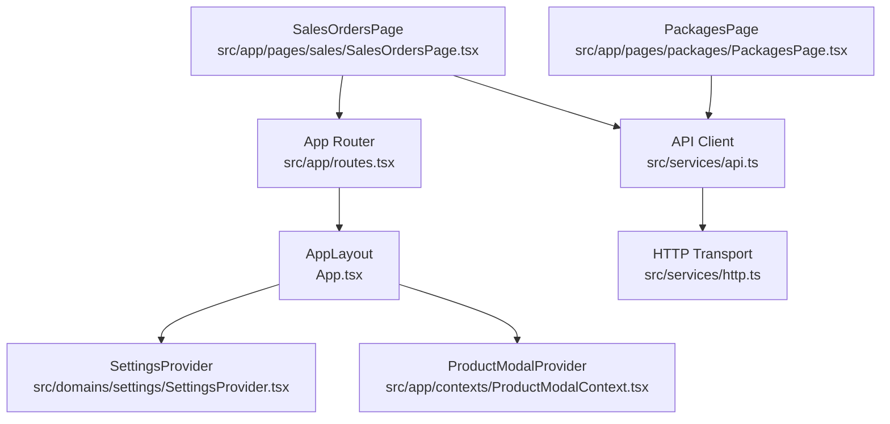

# STOCK- Repository Overview

## Directory Structure
```
.
├── App.tsx                     # Application layout with global providers and modals
├── src/main.tsx                # React entry point bootstrapping the router & local mocks
├── src/
│   ├── app/                    # Application shell, routing, shared layout and providers
│   │   ├── components/         # Global UI primitives (toasts, loading overlays, boundaries)
│   │   ├── contexts/           # React context declarations (e.g., product modal controller)
│   │   ├── layout/             # Top navigation and sidebar framing the UI
│   │   ├── pages/              # Feature pages mapped by the router
│   │   ├── providers/          # (Reserved) application-level providers
│   │   └── routes.tsx          # React Router definition for dashboard and feature areas
│   ├── domains/                # Domain-specific state, views, and hooks per business area
│   ├── i18n/                   # Localization dictionaries (e.g., Korean copy)
│   ├── services/               # API/http clients and domain service helpers
│   └── utils/                  # Cross-cutting utilities (env, formatting, reporting)
├── components/                 # Legacy/standalone React components for dashboard views
├── server/                     # Mock/companion Node backend with Prisma schema & tests
├── types.ts                    # Shared TypeScript domain models for products and orders
├── utils/                      # Additional top-level helpers consumed by components
├── vite.config.ts              # Vite build configuration
└── tsconfig.json               # TypeScript compiler options
```

## Module Roles
- **Routing (`src/app/routes.tsx`)** wires feature pages into the `AppLayout` shell rendered by `App.tsx`.
- **State Providers (`src/domains/settings/SettingsProvider.tsx`)** coordinate local storage, server synchronization, and user preferences.
- **Services (`src/services/api.ts`, `src/services/http.ts`, domain service files)** wrap HTTP access with environment-aware base URLs, error normalization, and feature-specific helpers.
- **Server (`server/`)** offers a Prisma-backed API mock used for integration testing and offline seeding.

## Routing, State & Service Flow


## Stabilization Plan (≤10 lines)
1. Harden Sales orders HTTP helper with request cancellation, debounced queries, and toast-based failure feedback.
2. Implement offline-first toggles keyed by settings (`useServer`) with graceful retries and background sync queues.
3. Normalize API schema parsing to coerce numeric/date fields and reject malformed payloads early.
4. Extend Packages page data hooks to validate totals, handle partial loads, and persist filter state locally.
5. Introduce shared error boundary utilities for packages/sales feature slices with actionable recovery UI.
6. Centralize status management (loading/error/empty) for table components to avoid inconsistent states.
7. Add integration tests hitting mock server endpoints for sales/package flows and offline cache usage.
8. Document environment expectations (VITE_API_URL, offline mode) in README for ops alignment.
9. Monitor fetch retries and offline recoveries with instrumentation hooks for future alerting.
10. Capture feedback loops between dashboards and downstream actions to inform future automation.
